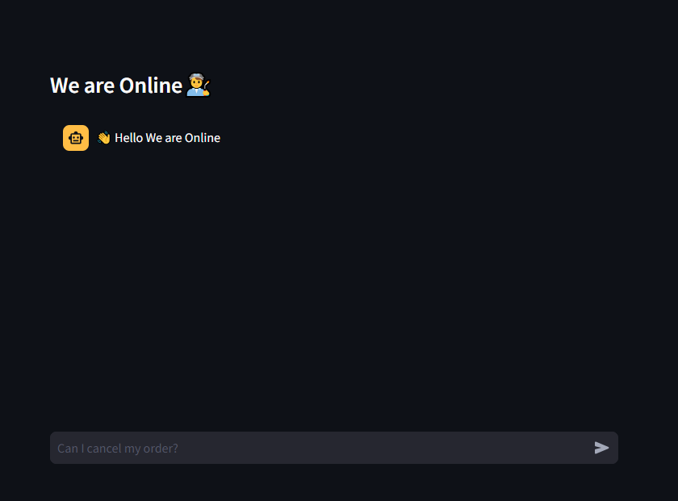
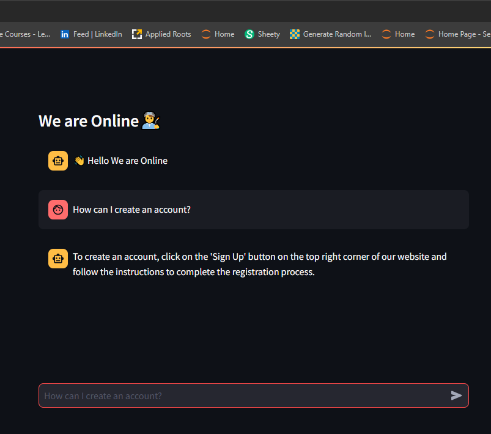
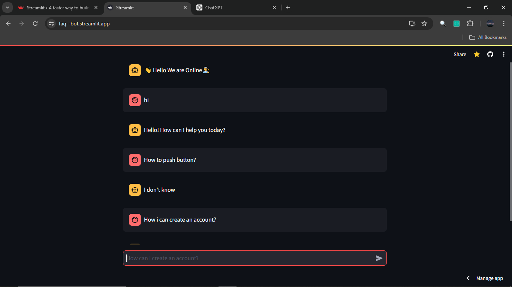
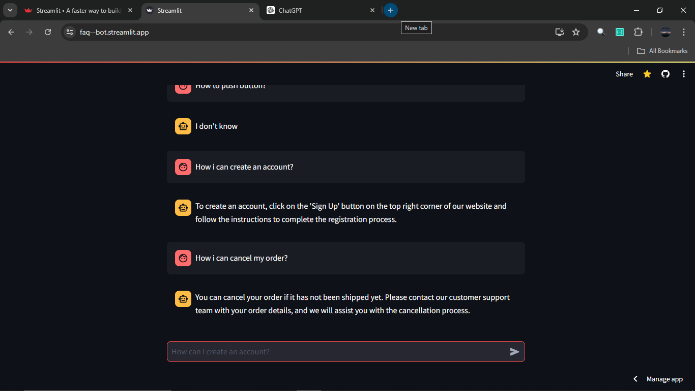

# FAQ--Bot

24 hours customer support. Question Answer Bot

## Description

FAQ--Bot is a chat-based question-answering system that provides support to customers. It uses a chat interface to communicate with users and generates responses based on the provided questions.

## Features

- 24 hours customer support
- Question Answer Bot

## Getting Started

To get started with FAQ--Bot, follow these steps:

1. Clone the repository:
   git clone https://github.com/Muhammad-Shah/FAQ--Bot.git
2. Install the dependencies:

   `pip install -r requirements.txt`
   `pip install jq-1.4.0-cp311-cp311-win_amd64.whl`

3. Set up the environment variables:

- Create a `.env` file in the root directory of the project.
- Add the following variables:
  ```
  GOOGLE_API=your_google_api_key
  HF_API=your_huggingface_api_key
  PINECONE_API=your_pinecone_api_key
  ```

4. Run the application:
   `streamlit run app.py`

## Usage

To use FAQ--Bot, follow these steps:

1. Open the chat interface.
2. Ask your question.
3. Wait for the bot to generate a response.

## Technologies Used

- Streamlit
- Langchain
- Chroma
- Pinecone
- Hugging Face

## Deployment

You can Access it on [FAQ Chatbot](https://faq--bot.streamlit.app/)

## Demo






## License

This project is licensed under the MIT License.

## Created By

Created by [Muhammad Shah](https://github.com/Muhammad-Shah)
